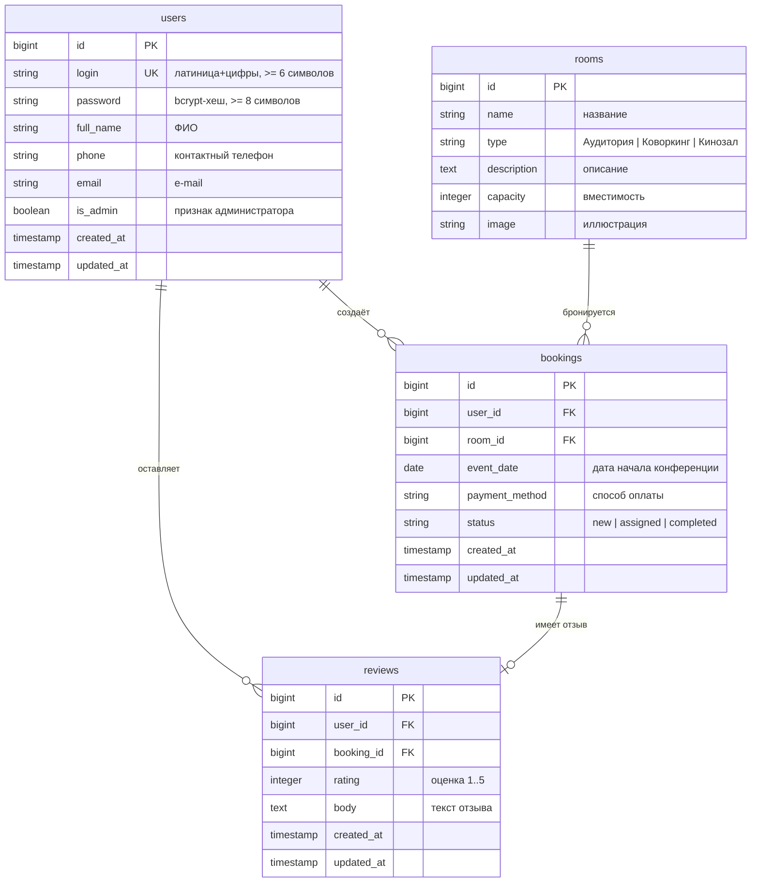

# Проектная документация — Портал «Конференции.РФ»

Демонстрационный экзамен 09.02.07, вариант № 2 (B2_КОД 09.02.07-3-2026).
Информационная система бронирования помещений для проведения конференций
(аудитория, коворкинг, кинозал).

## Технологический стек

| Слой | Технология |
|------|-----------|
| Бэкенд | PHP 8.4, Laravel 13 (ООП, MVC, Eloquent ORM) |
| База данных | SQLite |
| Шаблоны | Blade |
| Дизайн | Mobile-first CSS (390×844), Bootstrap Icons, Google Fonts |
| Интерактив | Vanilla JS (слайдер, всплывающие уведомления) |
| Окружение | Docker (php:8.4-cli), Docker Compose |
| Версионирование | Git |

## Роли пользователей

- **Гость** — может зарегистрироваться или войти.
- **Пользователь** — оформляет заявки на бронирование, смотрит их историю,
  оставляет отзывы (только после смены статуса администратором).
- **Администратор** (`Admin26` / `Demo20`) — видит все заявки, управляет их
  статусами, пользуется фильтрами/сортировкой/пагинацией.

## Жизненный цикл заявки

```
Новая (new) ──▶ Мероприятие назначено (assigned) ──▶ Мероприятие завершено (completed)
```
Статус меняет только администратор. Изначально каждая заявка — «Новая».

## ER-диаграмма



## Структура таблиц

### users
Регистрация требует: уникальный логин (латиница + цифры, ≥ 6 символов),
пароль (≥ 8 символов, хранится хешем), ФИО, телефон, e-mail.
Аутентификация — по паре «логин-пароль».

### rooms
Справочник помещений, заполняется сидером тремя записями: Аудитория, Коворкинг,
Кинозал. Используется в выпадающем списке при оформлении заявки.

### bookings
Заявка пользователя: помещение, дата начала, способ оплаты, статус.
Создаётся со статусом `new` и уходит на согласование администратору.

### reviews
Отзыв пользователя, привязанный к конкретной заявке. Доступен к созданию только
после того, как администратор изменил статус заявки (т.е. статус ≠ `new`).

## Карта страниц → требования задания

| Маршрут | Назначение | Пункты |
|---------|-----------|--------|
| `GET/POST /register` | Регистрация с валидацией и подсказками у полей | М1.1, М2.1 |
| `GET/POST /login` | Вход по логину/паролю, уведомления об ошибках | М1.2, М2.2 |
| `GET /cabinet` | Личный кабинет: история заявок, отзывы, слайдер | М1.3, М2.3 |
| `GET/POST /bookings/create` | Оформление заявки (выпадающие списки, дата ДД.ММ.ГГГГ) | М1.4, М2.4 |
| `GET /admin` | Панель администратора: заявки, фильтры, сортировка, пагинация | М1.5, М2.5 |
| `PATCH /admin/bookings/{id}/status` | Смена статуса заявки + уведомление | М1.5, М2.5 |
| `POST /logout` | Выход | — |

## Архитектура (MVC)

- **Модели** (`app/Models`): `User`, `Room`, `Booking`, `Review` — связи Eloquent.
- **Контроллеры** (`app/Http/Controllers`): `Auth\RegisterController`,
  `Auth\LoginController`, `CabinetController`, `BookingController`,
  `ReviewController`, `Admin\DashboardController`.
- **Middleware**: `EnsureUserIsAdmin` (доступ к админ-панели), стандартный `auth`.
- **Представления** (`resources/views`): Blade-шаблоны с общим mobile-first макетом.
- **Валидация**: FormRequest-классы с русскоязычными сообщениями.

## Безопасность

- Пароли хешируются (bcrypt).
- CSRF-защита на всех формах (встроено в Laravel).
- Доступ к админ-панели — через middleware и проверку `is_admin`.
- Пользователь видит только свои заявки; отзыв можно оставить только к своей
  заявке и только после согласования администратором.
